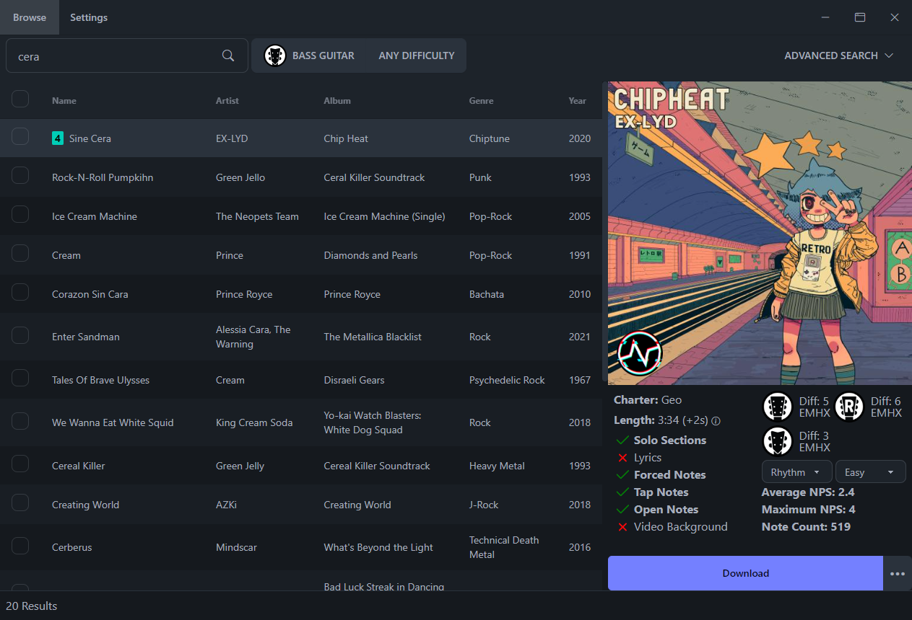

<p align="center">
  
</p>
<h3 align="center">A rhythm game chart searching and downloading tool.</h3>

<hr>

**Bridge** is a desktop app for searching, downloading, and managing charts for rhythm
games such as Clone Hero and YARG. It is the desktop client for
[Chorus Encore](https://www.enchor.us/), based on Geomitron's Bridge.

## Installation

Download the installer from the [Releases](https://github.com/s950tx16wasr10/Bridge/releases)
page (Windows). The app checks for updates on startup.

## Features

- Search every chart on Chorus Encore, with advanced per-field filters.
- Download charts as chart folders or `.sng` files, with a queue, multi-select,
  cancel, and retry.
- Library manager: scans local chart folders into a catalog, with search, filters,
  duplicate detection, and metadata editing.
- Discover: matches a Last.fm listening history against Chorus Encore and lists
  charts for the songs played most, with in-library detection and one-click download.
  Requires a Last.fm username and a free [API key](https://www.last.fm/api).
- Chart tools: lyrics injection from LRCLIB, album art fetching, background
  generation, and video background download. All tools work on both chart folders
  and `.sng` archives.
- Chart issue scanner for charters.
- Multiple UI themes.

## Development

Requires Node.js 22.

```
npm install
npm start
```

`npm test` runs the unit tests (vitest). `npm run build:windows` builds the installer.

## Community

Chorus Encore hosts the chart database this app depends on. To discuss it or help with
its server costs, see the [Discord](https://discord.gg/cqaUXGm) and
[Patreon](https://www.patreon.com/ChorusEncore701).
